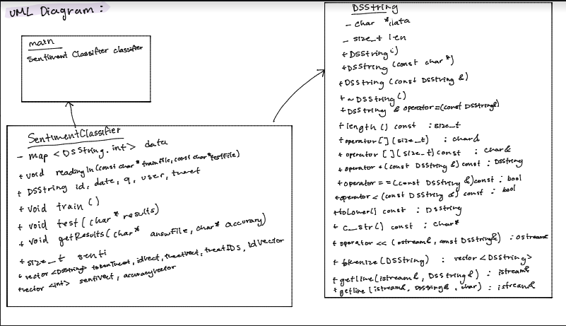

# Assignment 2: Answers

**Complete this document, commit your changes to Github and submit the repository URL to Canvas.** Keep your answers short and precise.

Your Name: Nayeli Sanchez

Used free extension: [ ] 24 hrs or [ ] 48 hrs

[ ] Early submission (48 hrs)

[ ] Bonus work. Describe: ...

Place [x] for what applies.

## UML Diagram

Add your UML class diagram here.

Replace the following image with your diagram. You can draw it by hand and take a photo.

## Answers

1. How do you train the model and how do you classify a new tweet? Give a short description of the main steps.

    > The code goes through the different tweets and gets the tweet to add the words (after being tokenized) to a map with a value for sentiment. If a word ever repeats, then the sentiment value is either reinforced or changed. After all the training tweets are classified, then it will determine a number (0 or 4) as a final sentiment value. ANy tweets that are processed through the analyzer would have a total sentiment value which is the total of all the words in the tweet. This will allow the analyzer to classify tweets with the sentiment that it was trained to have.

2. How long did your code take for training and what is the time complexity of your training implementation (Big-Oh notation)? Remember that training includes reading the tweets, breaking it into words, counting, ... Explain why you get this complexity (e.g., what does `N` stand for and how do your data structures/algorithms affect the complexity).

   > Your answer

3. How long did your code take for classification and what is the time complexity of your classification implementation (Big-Oh notation)? Explain why.

   > Your answer

4. What accuracy did your algorithm achieve on the provides training and test data? 

   > My accuracy: xx%

   The TA will run your code on Linux and that accuracy value will be used to determine your grade.

5. What were the changes that you made that improved the accuracy the most?
   
   > Your answer

6. How do you know that you use proper memory management? I.e., how do you know that you do not have
   a memory leak?

   > Usually to detect memory leaks you are able to use valgrind to ensure that all new instances are deleted. This makes it so that any leaks are avoided.

6. What was the most challenging part of the assignment?

   > Your answer
